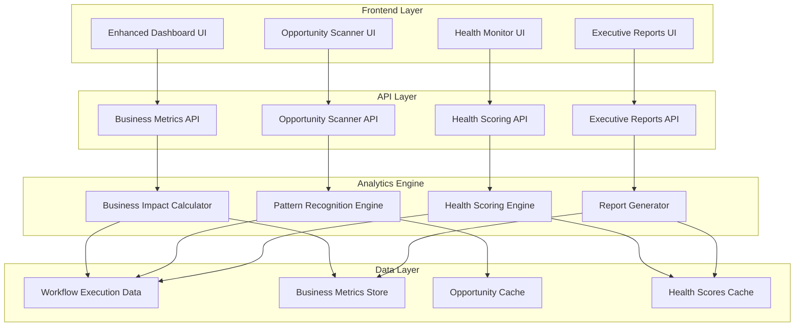

# Enhanced Client Dashboard Design Document

## Overview

The Enhanced Client Dashboard transforms the existing automation dashboard into a comprehensive business intelligence platform. The design focuses on four core capabilities: business process efficiency tracking, automation opportunity discovery, workflow health monitoring, and executive reporting. The system will leverage existing workflow execution data while adding new analytics layers to provide actionable business insights.

## Architecture

### High-Level Architecture



### Data Flow Architecture

The system processes workflow execution events in real-time to calculate business metrics, identify opportunities, and update health scores. Executive reports are generated on-demand with cached data for performance.

## Components and Interfaces

### 1. Business Process Efficiency Tracker

**Purpose**: Maps automation workflows to business outcomes and tracks efficiency improvements.

**Key Components**:
- Business Outcome Mapper: Links workflow executions to business metrics
- Efficiency Calculator: Computes before/after comparisons and trend analysis
- Impact Visualizer: Creates charts and graphs showing business impact

**API Endpoints**:
```typescript
GET /api/client-dashboard/business-outcomes
GET /api/client-dashboard/efficiency-trends
POST /api/client-dashboard/outcome-mapping
```

**UI Components**:
- Business Impact Cards showing key metrics
- Trend charts with before/after comparisons
- Outcome attribution tables linking workflows to results

### 2. Automation Opportunity Scanner

**Purpose**: Analyzes patterns to identify new automation opportunities and provides ROI estimates.

**Key Components**:
- Pattern Recognition Engine: Identifies repetitive processes and bottlenecks
- ROI Calculator: Estimates potential savings for suggested automations
- Opportunity Ranker: Scores opportunities by impact and difficulty

**API Endpoints**:
```typescript
GET /api/client-dashboard/opportunities
POST /api/client-dashboard/opportunities/dismiss
POST /api/client-dashboard/opportunities/request
```

**UI Components**:
- Opportunity Cards with impact scores and ROI estimates
- Interactive opportunity explorer with filtering and sorting
- One-click request forms for new automations

### 3. Workflow Health Monitor

**Purpose**: Provides real-time health scoring and proactive issue detection for all workflows.

**Key Components**:
- Health Scoring Algorithm: Calculates 0-100 health scores based on multiple factors
- Predictive Analytics: Identifies potential issues before they occur
- Recommendation Engine: Suggests specific improvements for underperforming workflows

**API Endpoints**:
```typescript
GET /api/client-dashboard/workflow-health
GET /api/client-dashboard/health-recommendations
POST /api/client-dashboard/health-alerts/acknowledge
```

**UI Components**:
- Health Score Dashboard with color-coded status indicators
- Detailed health analysis views with trend charts
- Recommendation panels with actionable improvement suggestions

### 4. Executive Report Generator

**Purpose**: Creates professional, presentation-ready reports for executive stakeholders.

**Key Components**:
- Report Template Engine: Generates reports in multiple formats
- Data Aggregator: Compiles metrics across time periods and workflows
- Branding Customizer: Applies client branding to reports

**API Endpoints**:
```typescript
POST /api/client-dashboard/reports/generate
GET /api/client-dashboard/reports/{reportId}
POST /api/client-dashboard/reports/share
```

**UI Components**:
- Report Builder with customizable templates
- Preview interface with real-time updates
- Sharing and distribution controls

## Data Models

### Business Outcome Metrics
```typescript
interface BusinessOutcome {
  id: string;
  workflowId: string;
  outcomeType: 'leads_generated' | 'orders_processed' | 'tickets_resolved' | 'custom';
  value: number;
  timestamp: Date;
  metadata: Record<string, any>;
}

interface EfficiencyMetric {
  workflowId: string;
  period: string;
  beforeAutomation: {
    timeSpent: number;
    errorRate: number;
    throughput: number;
  };
  afterAutomation: {
    timeSpent: number;
    errorRate: number;
    throughput: number;
  };
  improvement: {
    timeReduction: number;
    errorReduction: number;
    throughputIncrease: number;
  };
}
```

### Automation Opportunities
```typescript
interface AutomationOpportunity {
  id: string;
  title: string;
  description: string;
  category: 'data_entry' | 'communication' | 'reporting' | 'integration';
  impactScore: number; // 1-10
  difficultyScore: number; // 1-10
  estimatedROI: {
    timeSavingsHours: number;
    costSavings: number;
    paybackPeriodMonths: number;
  };
  requiredIntegrations: string[];
  status: 'identified' | 'dismissed' | 'requested' | 'implemented';
  identifiedAt: Date;
}
```

### Workflow Health Scores
```typescript
interface WorkflowHealth {
  workflowId: string;
  healthScore: number; // 0-100
  lastCalculated: Date;
  factors: {
    successRate: number;
    performanceTrend: number;
    errorPattern: number;
    businessImpact: number;
  };
  recommendations: HealthRecommendation[];
  alerts: HealthAlert[];
}

interface HealthRecommendation {
  type: 'performance' | 'reliability' | 'optimization';
  priority: 'low' | 'medium' | 'high';
  title: string;
  description: string;
  estimatedImpact: string;
  implementationEffort: 'low' | 'medium' | 'high';
}
```

### Executive Reports
```typescript
interface ExecutiveReport {
  id: string;
  title: string;
  period: {
    start: Date;
    end: Date;
  };
  sections: ReportSection[];
  branding: {
    companyName: string;
    logoUrl?: string;
    primaryColor?: string;
  };
  format: 'pdf' | 'pptx' | 'web';
  generatedAt: Date;
  shareableLink?: string;
}

interface ReportSection {
  type: 'summary' | 'metrics' | 'opportunities' | 'health' | 'recommendations';
  title: string;
  content: any;
  visualizations: ChartConfig[];
}
```

## Error Handling

### Business Metrics Calculation Errors
- Graceful degradation when business outcome data is incomplete
- Fallback to technical metrics when business metrics are unavailable
- Clear indicators when data quality affects calculations

### Opportunity Detection Failures
- Continue showing previously identified opportunities if analysis fails
- Provide manual opportunity submission as backup
- Log pattern recognition errors for system improvement

### Health Score Calculation Issues
- Use partial health scores when some factors are unavailable
- Maintain historical health data during calculation failures
- Provide manual health overrides for critical workflows

### Report Generation Failures
- Offer simplified report formats if full generation fails
- Cache partial reports for retry scenarios
- Provide raw data export as fallback option

## Testing Strategy

### Unit Testing
- Business metric calculation algorithms
- Health scoring logic with various input scenarios
- Opportunity detection pattern matching
- Report generation template rendering

### Integration Testing
- End-to-end workflow execution to business outcome tracking
- Real-time health score updates during workflow execution
- Report generation with actual client data
- API endpoint integration with existing dashboard components

### Performance Testing
- Dashboard load times with large datasets
- Real-time health score calculation performance
- Report generation speed for various time periods
- Concurrent user access to analytics features

### User Acceptance Testing
- Executive report usability with actual stakeholders
- Opportunity identification accuracy validation
- Health score correlation with actual workflow issues
- Business outcome attribution verification

## Security Considerations

### Data Privacy
- Business outcome data encryption at rest and in transit
- Role-based access to sensitive business metrics
- Audit logging for executive report access
- Secure sharing links with expiration dates

### Report Security
- Watermarking for shared executive reports
- Access control for report distribution
- Secure deletion of temporary report files
- Authentication for report viewing links

### Analytics Security
- Rate limiting on analytics API endpoints
- Input validation for custom business outcome definitions
- Secure storage of opportunity detection patterns
- Protection against data inference attacks