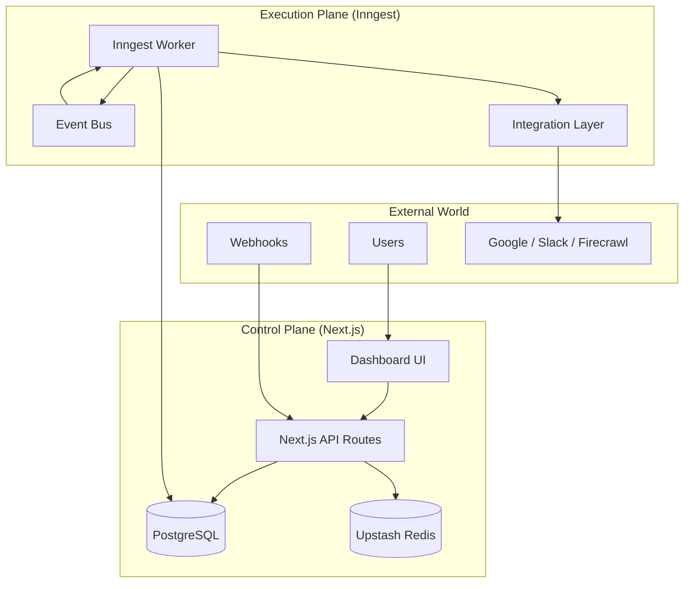

# Duramation: Distributed Workflow Automation Platform

[](https://duramation-frontend.vercel.app)
[](https://duramation-frontend.vercel.app)
[](LICENSE)

**Duramation** is a white-label, multi-tenant automation platform architected to handle complex, long-running business processes. Unlike simple task runners, it separates the **Workflow Engine** (Durable Execution) from the **Management Plane** (UI/API), allowing for independent scaling and failure isolation.

> **Why this exists:** To provide an embeddable, type-safe automation layer for SaaS platforms that requires "ROI Tracking" (Time/Cost savings) as a first-class citizen—something missing from standard tools like n8n or Zapier.

---

## 🏗 System Architecture

The system follows a distributed event-driven architecture using **Next.js** for the control plane and **Inngest** for the execution plane.



### Key Architectural Decisions

1.  **Durable Execution (Inngest):**
    *   Solves the "Dual Write" problem and handles transient failures (rate limits, network blips) automatically.
    *   Workflows can sleep for days (e.g., "Wait for email reply") without consuming compute resources.

2.  **Monorepo Strategy (TurboRepo):**
    *   `apps/frontend`: Management dashboard (Next.js 15, React 19).
    *   `apps/inngest-app`: Stateless worker nodes.
    *   `packages/integrations`: A strict, type-safe abstraction layer for 3rd-party APIs, decoupling business logic from vendor SDKs.
    *   `packages/db`: Shared Prisma schema with field-level encryption for credentials.

3.  **Security-First Design:**
    *   **Credential Encryption:** OAuth2 tokens and API keys are encrypted *at rest* in PostgreSQL using `prisma-field-encryption`.
    *   **Scoped Access:** Workflows run with the principle of least privilege, accessing only specifically granted connections.

---

## ⚡ Key Features

*   **Multi-Tenant by Design:** Built for SaaS. Data, workflows, and credentials are strictly isolated by User/Organization ID.
*   **Realtime Feedback Loop:** Uses Server-Sent Events (SSE) and Redis Pub/Sub to push workflow progress (steps, logs, errors) to the UI instantly.
*   **Business Value Tracking:** Native `AutomationMetrics` engine tracks `timeSaved` and `costSaved` per run, aggregating ROI for end-users.
*   **Resilient Integrations:**
    *   **Smart Rate Limiting:** Automatically backs off when 429s are detected.
    *   **Token Refresh:** Middleware automatically refreshes expired OAuth2 tokens before execution.

---

## 🛠 Tech Stack

| Layer | Technology | Justification |
|-------|------------|---------------|
| **Frontend** | Next.js 15 (App Router) | Server Components for secure data fetching; Streaming for performance. |
| **Engine** | Inngest | Handles state, retries, and scheduling better than bespoke queues (BullMQ). |
| **Database** | PostgreSQL + Prisma | Type-safe queries; ACID compliance for critical business data. |
| **Caching** | Upstash Redis | Serverless-friendly caching and Pub/Sub for realtime features. |
| **Styling** | Tailwind v4 + Shadcn/UI | Accessible, standardized design system. |

---

## 🚀 Quick Start (Local Development)

### Prerequisites
*   Node.js 20+
*   pnpm
*   PostgreSQL & Redis (Local or Cloud)

### 1. Clone & Install
```bash
git clone https://github.com/abdssamie/duramation.git
cd duramation
pnpm install
```

### 2. Configure Environment
Copy `.env.example` to `.env` in the root and both app directories.
```bash
cp .env.example .env
# Update DATABASE_URL, REDIS_URL, and INNGEST keys
```

### 3. Initialize Database
```bash
pnpm db:generate
pnpm db:migrate
```

### 4. Run the Stack
```bash
pnpm dev
```
*   **Dashboard:** [http://localhost:3000](http://localhost:3000)
*   **Inngest Dev Server:** [http://localhost:3001/api/inngest](http://localhost:3001/api/inngest)

---

## 🛡️ Security

*   **Zero-Trust Secrets:** Secrets are never sent to the client.
*   **Authentication:** Clerk for identity management.
*   **Validation:** Zod schemas for all API inputs and workflow configurations.

---

## 📄 License
MIT © [Abdssamie](https://github.com/abdssamie)